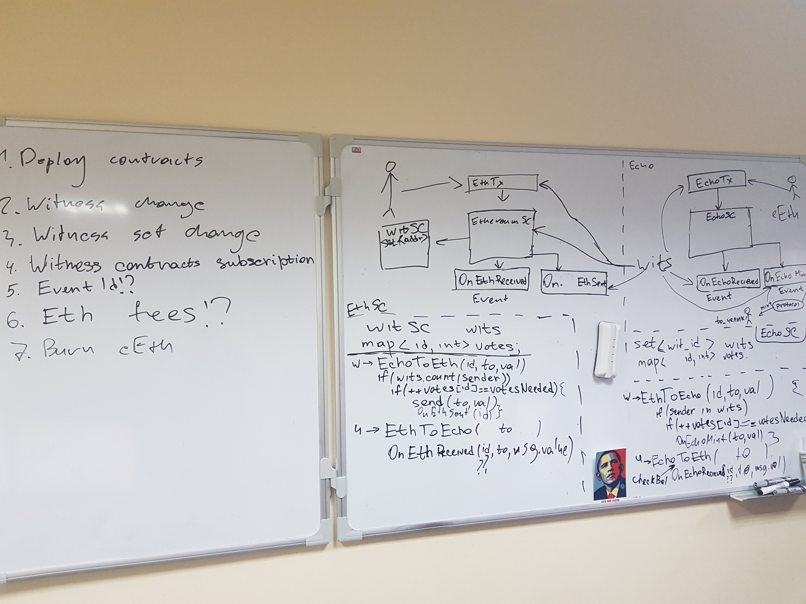
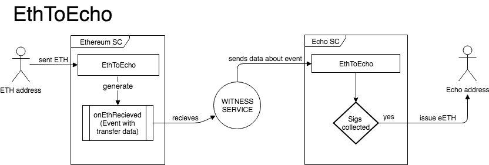

# Sidechain

## Используемые определения

[**DPOS**](http://docs.bitshares.org/bitshares/dpos.html) - Delegated proof-of-stake

[**Заверители (witnesses)**](http://docs.bitshares.org/bitshares/user/witness.html)- участники сети Echo, выбираемые голосованием, осуществляющие обработку переводов между сетями Ethereum/Echo

[**Смарт-контракты**](https://ru.wikipedia.org/wiki/Смарт-контракт) - Приложения на языке Solidity, работающие в EVM окружении

[**Актив**](http://docs.bitshares.org/bitshares/user/assets.html) - вид валюты на сети Echo, может создаваться и выпускаться пользователями.

**eETH** - предполагаемый актив(asset) в сети Echo, соответствующий ETH.

## Что такое SideChain

Sidechain это протокол переводов ETH между сетями Ethereum и Echo. Протокол также описывает процесс создания "зеркальных" активов на сети Echo. В основе лежит технология смарт-контрактов и консенсус dPOS.

## Требования

- Возможность конвертации ETH в ассет системы Echo
- Возможность конвертации ассета системы Echo в ETH

## Заверители

Заверители - участники сети Echo выполняющие связующую функцию между сетями Ethereum/Echo. Для совершения действий в рамках протокола нужно согласие квалифицированного большинства текущего состава заверителей. Квалифицированное большинство составляет более двух третьих от общего количества голосов.

Начальное множество заверителей задается в genesis блоке сети Echo, впоследствии оно может меняться (см. [Изменение набора заверителей](#изменение-набора-заверителей)). Основная задача заверителей - обработка событий, генерируемых смарт-контрактами.

## Смарт-контракты

Пользователи переводят свои средства на смарт-контракт соответствующей сети. Данный перевод генерирует некоторый объект события, который обрабатывается заверителями. Предполагаемая структура контрактов описана ниже.

| Ethereum | Echo |
|--|--|
| `map<id, set<Address>> votes` `array<address> wits` `array<hash> votes` | `map<id, int> votes` `array<account_id> wits` |
|`EthToEcho(to)` `EchoToEth(id, to, val)` `replaceWits(array<address> new)`| `EthToEcho(id, to, val)` `EchoToEth(to)` `replaceWits(array<account_id> new)` |

Смартконтракт в сети Echo инициализируются в genesis-блоке.

### Ethereum

`map<id, set<Address>> votes` ассоциативный контейнер, сопоставляющий id перевода c полученными голосами.

`set<address> wits` множество текущих заверителей

`EthToEcho(to)`
В качестве параметра передается адрес получателя на сети Echo метод генерирует событие, содержащее:

- id совершаемого перевода, должен быть уникальным
- получателя из параметра метода
- количество ETH прикрепленного к вызову (сумма перевода)

Этот метод может вызывать любой пользователь

`EchoToEth(id, to, val)`
В качестве параметра передается id перевода из сети Echo, адрес получателя, сумму перевода. Метод должен добавить адрес отправителя в votes[id].
Если размер votes[id] равно ближайшему целому к 2*|wits|/3 (с округлением в большую сторону) выполнить перевод ETH в количестве val на адрес to.

Этот метод могут вызывать только текущие заверители

### Echo

Смарт контракт для Echo симметричен контракту на Ethereum за исключением необходимости хранения множества заверителей (они могут быть получены через EVM-Echo интерфейс).

Также присутствует отличие в начислении средств пользователям при переводе. Echo контракт генерирует новые активы, в то время как Ethereum контракт отправляет средства из своего баланса.

В качестве аналога ETH на сети Echo создается актив eETH. Весь доступный баланс ассета изначально выпускается на баланс контракта сайдчейна в genesis-блоке.

## Работа протокола

Как упомянуто выше, заверители отслеживают события смарт-контрактов, проверяют транзакции, голосуют за них.

### Транзакция Ethereum -> Echo

Базовый сценарий выглядит так:

- Пользователь вызывает метод EthToEcho смарт-контракта на ethereum, в качестве аргумента передавая адрес акаунта на сети Echo и прикрепляя средства, которые он хочет перевести.
- При обработке транзакции Ethereum генерируется событие.
- Заверители получают событие, вызывают метод EthToEcho смарт-контракта на Echo, передавая туда параметры предполагаемой транзакции и увеличивая счетчик голосов.
- По достижению необходимого количества голосов на смарт-контракте Echo осуществляется выпуск указанного количества eETH на адрес получателя.

>    При неудачной попытке выпуска средств на аккаунт по причине его отсутсвия - смарт контракт Echo должен выпускать событие onEthReturn, которое должно обрабатываться точно так же, как событие onEchoRecieved. Получается, переводиться все будет по схеме перевода денег из сети Echo в сеть Ethereum и наличие нового ивента необходимо только для понимания того, что это был автоматический возврат средств, а не вывод кем либо из сети Echo. Возможен так же вариант, с указанием аккаунта отправителя в ивенте в виде какого-либо системного адреса(адрес контракта ораклов в сети Echo, но вариант с отдельным ивентом очевиднее)

### Транзакция Echo -> Ethereum

- Пользователь вызывает метод `EchoToEth` смарт-контракта на Echo, в качестве аргумента передавая адрес аккаунта на сети Ethereum и прикрепляя актив eETH, который он хочет вывести
- При обработке перевода генерируется событие.
- Заверители получают событие, вызывают метод `EchoToEthSig` смарт-контракта Echo, передавая туда параметры для вывода и подпись.
- По достижению необходимого количества подписей на смарт-контракте Echo генерируется событие `transactionReady`, содержащее все данные и подписи.
- Событие должно отобразиться у пользователя. Данные из последнего пользователь отправляет в контракт `Ethereum`, после чего происходит паеревод указанной суммы на указанный в параметрах адрес(подписаны, поэтому изменить нельзя). В принципе, вызов может быть оплачен любым адресом, но деньги уйдут именно на указанный в параметрах.

### Изменение набора заверителей

Изменение списка заверителей происходит во время обслуживания сети (maintenance). За раз может смениться максимум `1/3*n-1`. Это необходимо для того, чтобы смену могли подтвердить только оставшиеся в текущем наборе заверители, без учета исключенных и добавленных.

После смены заверителей, на стороне echo протоколом вызывается (с помощью виртуальной операции, подтверждать не нужно) метод контракта `replaceWits(array<address> new_wits)`, который заменяет набор аккаунтов, соотвествующий заверителям в контракте. На стороне Echo текущими заверителями вызывается метод контракта `replaceWits(sig_t sig)`, в который передается подпись нового набора заверителей. При получении подпись она сверяется с набором заверителей, который был передан протоколом и подпись созраняется. При достижении необходимого количества подписей - эти данные необходимо передать в контракт Ethereum, с помощью вызова вручную. Это может сделать **любой аккаунт**, предположительно делает заверитель.

## Вознаграждение заверителям

Для погашения комиссии, оплаченной для выпуска транзакций, а так же для стимулирования работы свидетелей, свидетели ежедневно получают 20% от всей комиссии за транзакции сети Echo.

